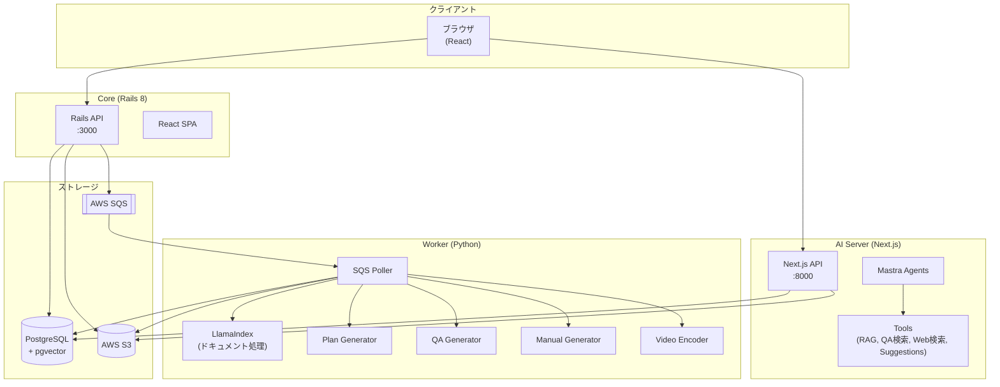
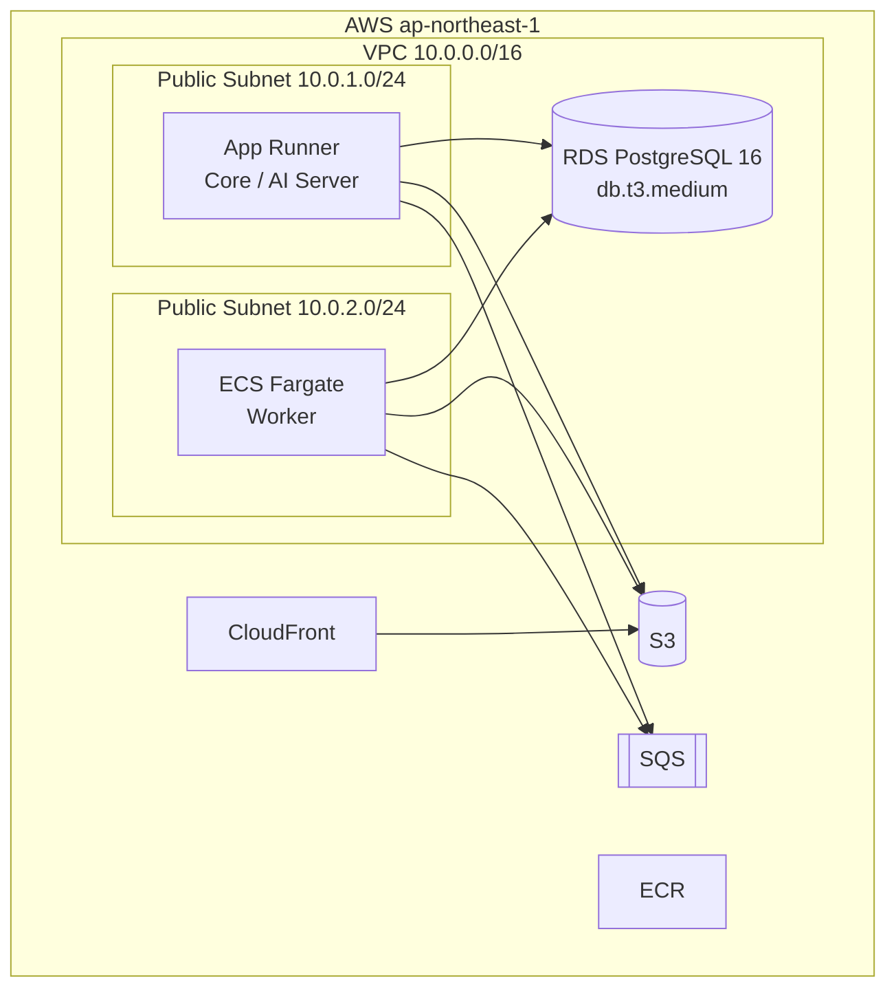
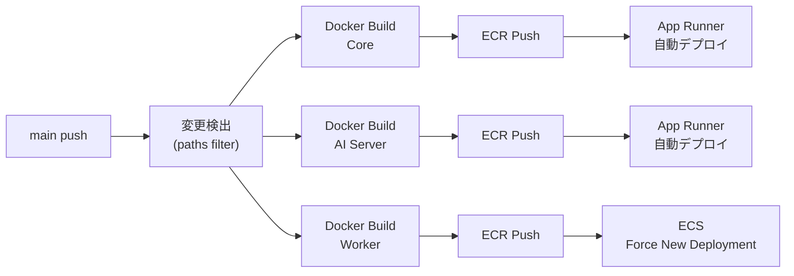
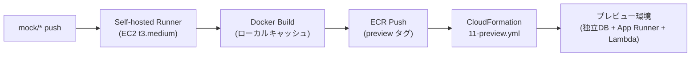

# アーキテクチャ概要

## サービス構成



## 各サービスの役割

### Core (Rails 8 + React)

**役割**: メインアプリケーション。ユーザー認証、データ管理、フロントエンドUIを提供。

| コンポーネント | 責務 |
|--------------|------|
| Rails API | REST API、認証、データ永続化 |
| React SPA | チャットUI、ダッシュボード |

**主要エンドポイント**:
- `GET/POST /api/messages` - メッセージCRUD
- `GET/POST /api/rooms` - チャットルーム管理
- `GET/POST /api/requests` - ヒアリングリクエスト管理
- `GET/POST/DELETE /api/topics/:id/data_source_links` - DS↔トピック連携
- `GET/POST /api/data_source_files` - データソースファイル管理
- `GET/POST /api/data_source_folders` - データソースフォルダ管理
- `GET/POST/PATCH/DELETE /api/glossary_terms` - 社内辞書管理

### AI Server (Next.js + Mastra)

**役割**: AI推論サーバー。チャット応答生成、RAG検索、ツール実行を担当。

| コンポーネント | 責務 |
|--------------|------|
| Mastra Agents | AI会話エージェント管理 |
| RAG Retriever | ベクトル検索 + Cohere Rerank |
| Web Search | DuckDuckGo検索 |

**エージェント種別**:

| エージェント | 用途 | ツール |
|------------|------|--------|
| hearing-agent | ヒアリング対話 | send_suggestions |
| validation-agent | 検証・確認 | rag_retriever, qa_query, web_search |
| topic-agent | トピック議論 | rag_retriever, qa_query, web_search |

### 開発中の機能

以下の機能は現在開発中で、ai-server単体（`ai-server/app/page.tsx`）からのみ利用可能です。

| エージェント | 用途 | 状態 |
|------------|------|------|
| flow-agent | 構造化審査フロー（flow.jsonベース） | 開発中 |
| qa-agent | フローに関するQA回答 | 開発中 |

### Worker (Python)

**役割**: バックグラウンド処理ワーカー。SQSをポーリングし、ドキュメント処理・プラン生成・QA生成を実行。

| コンポーネント | 責務 |
|--------------|------|
| SQS Poller | キューからジョブ取得・ルーティング |
| LlamaIndex | ドキュメント解析・ベクトル化（pdf, docx, pptx, xlsx, txt, csv等） |
| DS Indexer | データソースファイルのS3→テキスト抽出→ベクトルDB登録 |
| Plan Generator | ヒアリング計画の自動生成 |
| QA Generator | ヒアリング結果からQAペア抽出 |
| Manual Generator | マニュアル自動生成 |
| Video Encoder | 動画ファイルエンコード |

## 技術スタック

### バックエンド

| 技術 | バージョン | 用途 |
|-----|-----------|------|
| Ruby | 3.4.2 | Core言語 |
| Rails | 8.0+ | Webフレームワーク |
| PostgreSQL | 16 | データベース |
| pgvector | - | ベクトル検索 |
| AWS SQS | - | ジョブキュー |

### AIサーバー

| 技術 | バージョン | 用途 |
|-----|-----------|------|
| Node.js | 22+ | ランタイム |
| Next.js | 16.1 | フレームワーク |
| Mastra | 1.1.0 | エージェント管理 |
| OpenAI | GPT-4.1 | LLM |
| Cohere | - | Rerank API |

### フロントエンド

| 技術 | バージョン | 用途 |
|-----|-----------|------|
| React | 18.2 | UIライブラリ |
| TypeScript | 5+ | 型付け |
| TailwindCSS | 4.x | スタイリング |
| Radix UI | - | UIコンポーネント |
| shadcn/ui | - | デザインシステム |

### インフラ

| 技術 | 用途 |
|-----|------|
| Docker | コンテナ化 |
| AWS App Runner | Core/AIサーバーホスティング |
| AWS ECS Fargate | Workerホスティング |
| AWS S3 | ファイルストレージ |
| AWS SQS | メッセージキュー |
| AWS RDS | マネージドPostgreSQL |

## ポート番号

| サービス | 開発環境 | コンテナ内部 | 本番環境 |
|---------|---------|------------|---------|
| Core (Rails) | 3000 | 3000 | App Runner |
| AI Server | 8000 | 3000 | App Runner |
| Worker | - | - | ECS Fargate |
| PostgreSQL | 5432 | 5432 | RDS |
| Mailpit (メールUI) | 8025 | - | - |

> **注意**: AI Server は開発環境ではホスト側 8000 番でアクセスするが、コンテナ内部では 3000 番で動作する。Core からコンテナ間通信する際は `http://ai-server:3000` を使用する。

## モジュール化設計

Packwerk + packs-railsによるBC分割、Feature Management、オンプレ提供方針については以下を参照。

- [モジュール化設計](./modularization/README.md)
- [オンプレミス提供方針](./modularization/on-premise-strategy.md)

---

## サービス間通信

### Core ↔ AI Server（サーバーサイド）

Core は Faraday HTTP クライアントで AI Server の REST API を呼び出す。

```
Core (Rails) --Faraday HTTP--> AI Server (Next.js :3000)
```

| 設定 | 値 | ソース |
|-----|-----|--------|
| ベースURL | `http://ai-server:3000`（コンテナ間） | `core/app/services/ai_server_client.rb` |
| 環境変数 | `AI_SERVER_URL_FROM_CONTAINER` | 未設定時はデフォルト値を使用 |
| タイムアウト | 30秒 | `faraday.options.timeout` |
| 接続タイムアウト | 10秒 | `faraday.options.open_timeout` |
| リクエスト形式 | JSON | `faraday.request :json` |
| レスポンス形式 | JSON（symbolize_names） | `faraday.response :json` |
| エンドポイント | `GET /api/knowledge-hearing-qa` | QAデータ取得 |

### Frontend → AI Server（SSE ストリーミング）

ブラウザから AI Server へ直接 SSE（Server-Sent Events）接続し、チャット応答をストリーミングする。

```
Browser (React) --SSE/fetch--> AI Server (Next.js)
```

| 設定 | 値 | 備考 |
|-----|-----|------|
| ライブラリ | Vercel AI SDK (`@ai-sdk/react`) | `useChat` + `DefaultChatTransport` |
| エンドポイント | `/api/hearing`, `/api/validation`, `/api/topic` | エージェント種別ごと |
| URL注入 | `AI_SERVER_URL` | **ビルド時に esbuild で注入**（後述） |

> **重要: AI_SERVER_URL のビルド時注入**
>
> `AI_SERVER_URL` は Docker ビルド時に `ARG` として渡され、esbuild の `define` オプションで JavaScript バンドルにハードコードされる。ランタイムの環境変数ではないため、URL を変更するには Docker イメージの再ビルドが必要。
>
> ```
> Dockerfile.prod: ARG AI_SERVER_URL → ENV AI_SERVER_URL
> esbuild-config.js: define: { 'process.env.AI_SERVER_URL': JSON.stringify(...) }
> ```

### Core → SQS → Worker

Core がドキュメント処理やプラン生成をリクエストする際、SQS にメッセージを送信し、Worker がポーリングで取得する。

```
Core (Rails) --SQS SendMessage--> SQS Queue --Long Polling--> Worker (Python)
```

**SQS メッセージフォーマット** (`core/app/services/sqs_message_service.rb`):

```json
{
  "request_id": 123,
  "document_ids": [1, 2, 3],
  "topic_id": 456,
  "next_status": "not_started",
  "request_type": "hearing",
  "action_type": "hearing_create",
  "timestamp": "2026-01-15T10:30:00+09:00"
}
```

| フィールド | 型 | 説明 |
|-----------|-----|------|
| `request_id` | Integer | リクエストID |
| `document_ids` | Integer[] | 処理対象ドキュメントID（空配列の場合あり） |
| `topic_id` | Integer | トピックID |
| `next_status` | String | 処理後のステータス |
| `request_type` | String | `hearing` or `manual` |
| `action_type` | String | ルーティングキー（下記参照） |
| `timestamp` | String | ISO 8601 タイムスタンプ |

**action_type によるルーティング**:

| action_type | 処理内容 |
|------------|---------|
| `hearing_create` | ドキュメント処理 + プラン生成 |
| `hearing_update` | ドキュメント再処理 + プラン再生成 |
| `rehearing_create` | 再ヒアリング用プラン生成 |
| `hearing_finish` | QA生成（ヒアリング完了時） |
| `manual_create` | マニュアル自動生成 |
| `manual_video_update` | 動画エンコード |
| `data_acquisition_upload` | データソースファイルのベクトルDBインデキシング |

### Worker SQS ポーリング設定

| 設定 | 値 | 備考 |
|-----|-----|------|
| 最大メッセージ数/回 | 1 | 1メッセージずつ処理 |
| ロングポーリング待機 | 20秒 | `WaitTimeSeconds` |
| ループ間隔 | 1秒 | `asyncio.sleep(1)` |
| エラー時リトライ間隔 | 5秒 | `asyncio.sleep(5)` |

---

## インフラ構成

### AWS アカウント・リージョン

| 項目 | 値 |
|-----|-----|
| AWS リージョン | ap-northeast-1（東京） |
| AWS アカウントID | 778389812638 |
| IAM ロール（GitHub Actions） | skillrelay-production-github-actions-role |

### リソース一覧



### スペック詳細

| リソース | サービス | スペック | 備考 |
|---------|---------|---------|------|
| App Runner | Core (Rails) | 1 vCPU / 2 GB | 自動デプロイ有効 |
| App Runner | AI Server (Next.js) | 1 vCPU / 2 GB | 自動デプロイ有効 |
| ECS Fargate | Worker (Python) | 2 vCPU / 4 GB | Desired Count: 1 |
| RDS | PostgreSQL 16 | db.t3.medium / 20 GB gp2 | 暗号化有効、バックアップ7日 |
| SQS | ドキュメント処理キュー（本番） | 可視性タイムアウト 300秒 | DLQ有効（最大受信3回） |
| SQS | DLQ（本番） | メッセージ保持14日 | 処理失敗メッセージの退避先 |
| SQS | ドキュメント処理キュー（プレビュー） | 可視性タイムアウト 300秒 | プレビュー環境ごとに独立 |
| S3 | プレビュー環境専用バケット | - | 環境ごとに独立、30日自動有効期限 |
| CloudFront | 動画配信 | 署名付きURL/Cookie | S3オリジン |

### ヘルスチェック設定

| サービス | プロトコル | パス | 間隔 | タイムアウト | 正常閾値 | 異常閾値 |
|---------|----------|------|------|------------|---------|---------|
| Core（本番） | HTTP | `/up` | 10秒 | 5秒 | 1 | 5 |
| AI Server（本番） | HTTP | `/api/health` | 10秒 | 5秒 | 1 | 20 |
| Core（プレビュー） | HTTP | `/up` | 20秒 | 10秒 | 1 | 10 |

> **AI Server の異常閾値が 20 と高い理由**: AI Server は起動時に Mastra の初期化（エージェント・ツール登録）が行われ、ヘルスチェックが通るまで時間がかかる。閾値を低くすると起動完了前にデプロイ失敗と判定されてしまう。

### CloudFormation スタック構成

12テンプレートで構成。`cloudformation/templates/` に格納。

| No. | テンプレート | 内容 |
|----|------------|------|
| 01 | `01-network.yml` | VPC、サブネット、セキュリティグループ |
| 02 | `02-database.yml` | RDS PostgreSQL |
| 03 | `03-ecr.yml` | ECR リポジトリ |
| 04 | `04-iam.yml` | 本番用 IAM ロール・ポリシー |
| 05 | `05-iam-dev.yml` | 開発用 IAM ロール・ユーザー |
| 06 | `06-apprunner-shared.yml` | App Runner 共有リソース |
| 07 | `07-apprunner.yml` | App Runner サービス（Core / AI Server） |
| 08 | `08-sqs.yml` | SQS キュー（処理キュー + DLQ） |
| 09 | `09-ecs.yml` | ECS Fargate サービス（Worker） |
| 10 | `10-cloudfront.yml` | CloudFront（動画配信、署名付きアクセス） |
| 11 | `11-preview.yml` | プレビュー環境（mock ブランチ用） |
| 12 | `12-self-hosted-runner.yml` | GitHub Actions self-hosted runner (EC2) |

---

## デプロイフロー

### 本番デプロイ（main ブランチ push）



**主要ステップ**:

1. `main` ブランチへの push がトリガー
2. 変更検出（paths filter）で変更があったサービスのみビルド
3. Docker Buildx でイメージをビルド（GHA キャッシュ使用）
4. ECR にプッシュ
5. Core / AI Server: App Runner が ECR イメージの更新を自動検出してデプロイ
6. Worker: ECS サービスを `force-new-deployment` で更新（サーキットブレーカー有効、ロールバック付き）

### プレビューデプロイ（mock/* ブランチ push）



**特徴**:
- `mock/**` ブランチへの push がトリガー
- **Self-hosted Runner (EC2)** で実行 — GitHub-hosted runner の課金を回避
- `concurrency` グループによるジョブキューイング（同時実行なし、待ち行列方式）
- EBS 上の永続 Docker キャッシュにより高速ビルド
- CloudFormation `12-self-hosted-runner.yml` でランナーインフラを管理
- CloudFormation `11-preview.yml` で独立した環境を構築
- **独立したデータベース**（`skillrelay_mock_*`）を使用 — 本番DBとは完全分離
- **独立したSQSキュー**（`skillrelay-mock-*-document-processing`）— 本番Workerとジョブが混在しない
- **独立したS3バケット**（`skillrelay-preview-*`）— 本番ストレージとファイルが混在しない（30日自動有効期限）
- スタック初回作成タイムアウト: 20分
- App Runner の自動デプロイは無効（ECR プッシュ時のみ）

### CI パイプライン

| ジョブ | 内容 |
|-------|------|
| lint | RuboCop（Ruby）、Brakeman（セキュリティ） |
| test | `rails test`（PostgreSQL 16 + pgvector） |
| build | `yarn build`、`yarn build:css`、`rails assets:precompile` |

---

## 重要な設定値

### AI / LLM

| 設定 | 値 | ソース |
|-----|-----|--------|
| チャットモデル | `gpt-5-mini` | `worker/src/config.py`, `ai-server/lib/config/index.ts` |
| 推論レベル（Worker） | `medium` | `worker/src/config.py` |
| 最大トークン（Worker） | 8192 | `worker/src/config.py` |
| LLMタイムアウト（Worker） | 300秒 | `worker/src/config.py` |
| ビジョンモデル | `gpt-4.1` | `worker/src/config.py` |
| Embedding モデル | `text-embedding-3-small` | 両サービス共通 |
| Embedding 次元数 | 1536 | 両サービス共通 |
| Embedding バッチサイズ | 100 | `worker/src/config.py` |
| Rerank モデル | `rerank-multilingual-v3.0` | `ai-server/lib/config/index.ts` |
| Rerank Top-N | 5 | `ai-server/lib/config/index.ts` |

### RAG / 検索

| 設定 | 値 | ソース |
|-----|-----|--------|
| チャンクサイズ | 1024 | 両サービス共通 |
| チャンクオーバーラップ | 200 | 両サービス共通 |
| ハイブリッド検索 テキスト重み | 0.3（30%） | `ai-server/lib/rag/vector-store.ts` |
| ハイブリッド検索 ベクトル重み | 0.7（70%） | `ai-server/lib/rag/vector-store.ts` |
| Similarity Top-K | 10 | `ai-server/lib/config/index.ts` |

### HNSW インデックスパラメータ

| パラメータ | 値 | 説明 |
|-----------|-----|------|
| `hnsw_m` | 16 | グラフの接続数 |
| `hnsw_ef_construction` | 64 | インデックス構築時の探索幅 |
| `hnsw_ef_search` | 40 | 検索時の探索幅 |
| 距離関数 | `vector_cosine_ops` | コサイン類似度 |

### メモリ管理（AI Server）

| 設定 | 値 | 説明 |
|-----|-----|------|
| トークン上限 | 30,000 | コンテキストウィンドウの制限 |
| チャット履歴比率 | 0.7（70%） | トークン上限のうち履歴に使う割合 |
| 直近メッセージ数 | 40 | 保持する最大メッセージ数 |
| エージェント最大イテレーション | 10 | ツール呼び出しの最大回数 |

### Worker / SQS

| 設定 | 値 | 説明 |
|-----|-----|------|
| SQS 可視性タイムアウト | 300秒 | Worker の LLM タイムアウトと一致 |
| SQS メッセージ保持期間 | 14日 | DLQ のメッセージ保持 |
| DLQ 最大受信回数 | 3 | 3回失敗で DLQ に移動 |

### URL / セッション

| 設定 | 値 | 説明 |
|-----|-----|------|
| S3 署名付きURL有効期限 | 3600秒（1時間） | `core/app/services/s3_service.rb` |

---

## 重要な設計判断と教訓

### DB 分離方式: スキーマ分離 → DB 分離

**経緯**: プレビュー環境は当初、本番 RDS 内にスキーマを分離する方式で運用していた。しかし、CloudFormation スタック削除時に本番スキーマが破壊されるインシデントが発生（[2026-02-23 インシデントレポート](./incidents/2026-02-23-preview-db-destruction.md)）。

**現在の方式**: プレビュー環境ごとに独立したデータベース（`skillrelay_mock_*`）を作成し、完全にDB分離する。

**教訓**: 共有リソース上の論理分離（スキーマ分離）は削除操作の影響範囲を制御しにくい。プレビュー環境のような一時的な環境は物理的に分離すべき。

### ヘルスチェックの限界

**問題**: App Runner のヘルスチェックは HTTP レスポンスのステータスコードのみを確認する。AI Server のように起動に時間がかかるサービスでは、異常閾値を高く設定する必要がある（AI Server: 20回）。

**Core のヘルスチェック**: `/up` は Rails 標準のヘルスチェックエンドポイント。DB接続を確認するが、外部サービス（SQS, S3, AI Server）の疎通は確認しない。

**プレビュー環境**: 起動がさらに遅いため、ヘルスチェック間隔を 20秒、タイムアウトを 10秒に緩和している。

### AI_SERVER_URL のビルド時注入

**背景**: React SPA はブラウザで動作するため、サーバーサイドの環境変数にアクセスできない。AI Server の URL をフロントエンドに渡すため、Docker ビルド時に esbuild の `define` で JavaScript バンドルに埋め込む。

**影響**: AI_SERVER_URL を変更するには Docker イメージの再ビルドが必要。環境変数の変更だけでは反映されない。

**ソース**: `core/Dockerfile.prod`（`ARG AI_SERVER_URL`）→ `core/scripts/esbuild-config.js`（`define`）

### CloudFormation スタック作成タイムアウト

**背景**: プレビュー環境の CloudFormation スタック初回作成時、App Runner サービスの起動やヘルスチェック通過に時間がかかり、デフォルトのタイムアウト（10分程度）では不足していた。

**対応**: スタック作成タイムアウトを **20分** に延長（`--timeout-in-minutes 20`）。

### SQS 可視性タイムアウトと LLM タイムアウトの整合

**設計**: SQS の可視性タイムアウト（300秒）は Worker の LLM タイムアウト（300秒）と一致させている。これにより、LLM の処理中にメッセージが再配信されることを防ぐ。

**注意**: LLM タイムアウトを変更する場合は、SQS の可視性タイムアウトも合わせて変更する必要がある。
