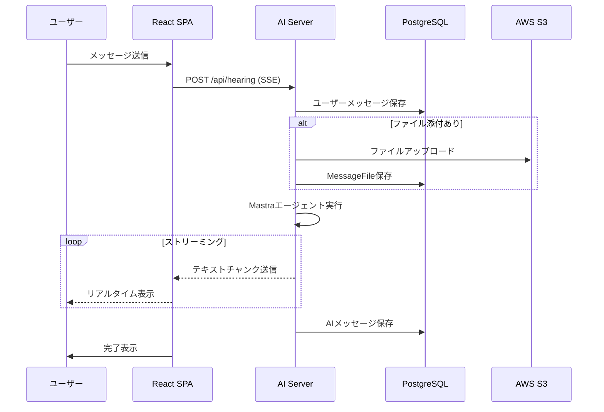
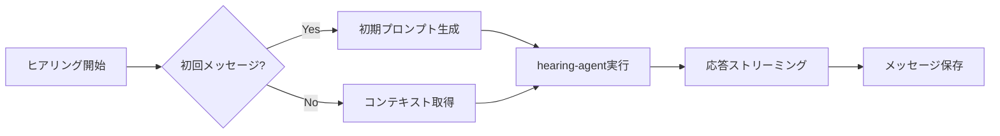
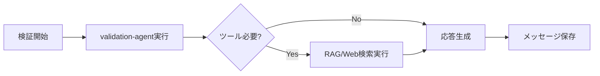
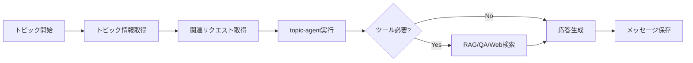
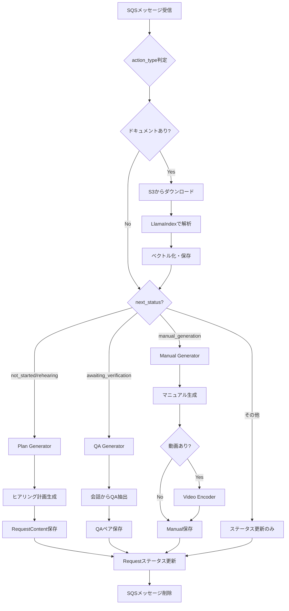
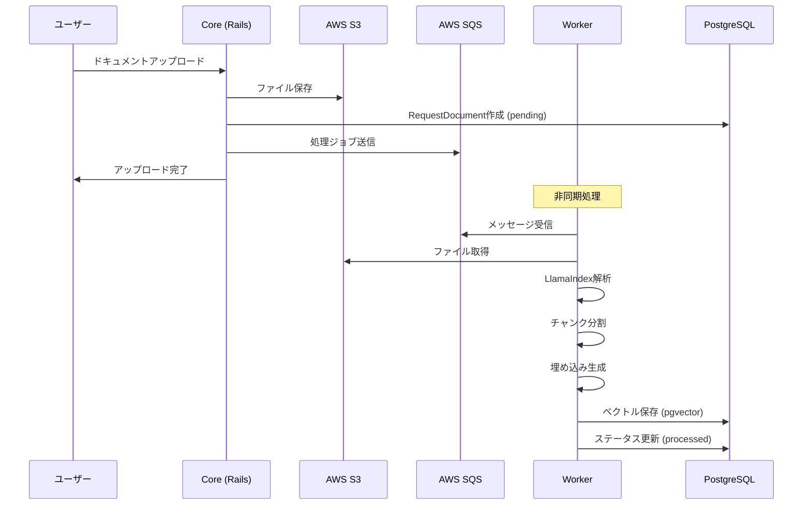
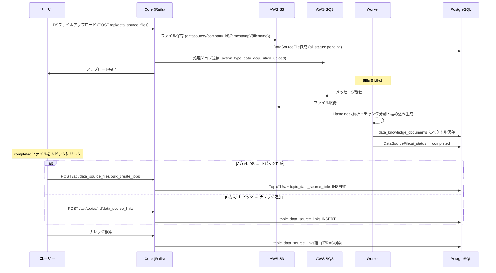
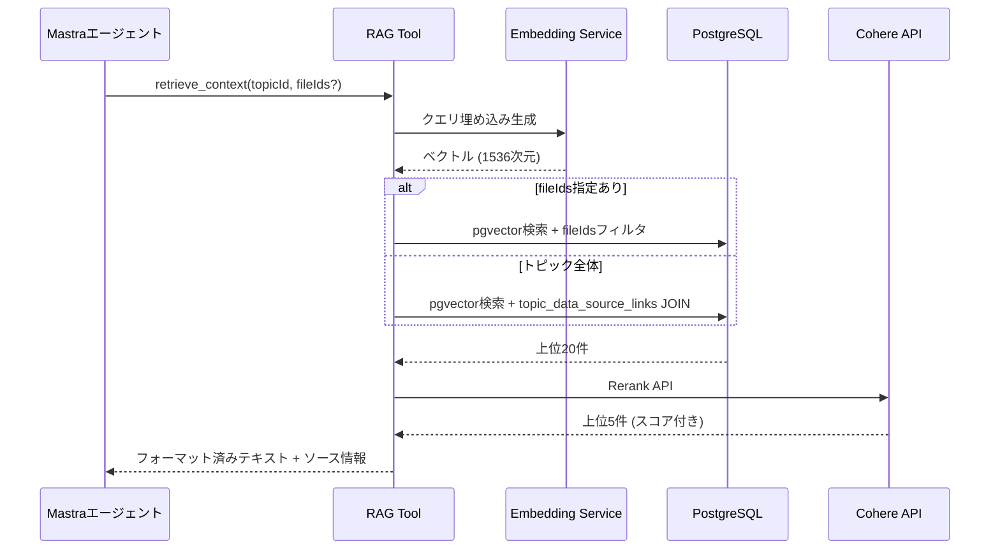
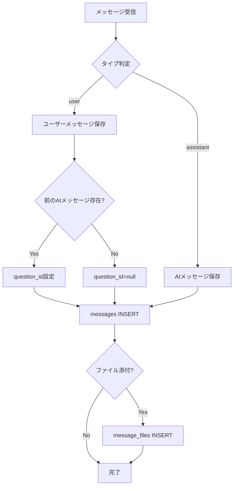
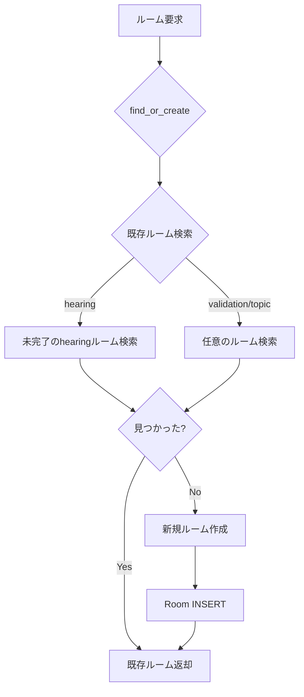

# データフロー

## チャット処理フロー

ユーザーがチャットを送信してから応答が表示されるまでの流れ。

## チャット種別ごとの処理

### Hearing (ヒアリング)

ユーザーから情報を収集するための対話。

### Validation (検証)

収集した情報の検証・確認を行う対話。ツールを使用可能。

### Topic (トピック)

トピック単位での横断的な議論。複数リクエストの情報を参照可能。

## Worker処理フロー

WorkerはSQSからメッセージを受信し、`next_status`に応じて異なる処理を実行。

## ドキュメント処理フロー

### ヒアリング添付ドキュメント

ユーザーがヒアリング中にアップロードしたドキュメントがベクトル化されるまでの流れ。

### データソースファイル処理

DSファイルがアップロードされ、ベクトル化後にトピックにリンクされるまでの流れ。

## RAG検索フロー

ユーザーの質問に対して関連ドキュメントを検索する流れ。トピック内のナレッジ検索では、`topic_data_source_links` 中間テーブルを経由してリンク済みファイルのチャンクのみを対象にフィルタする。

**検索モード:** ハイブリッド検索（デフォルト）= ベクトル類似度(0.7) + 全文テキスト検索(0.3)のスコア合成。vector / text 単独モードも選択可能。

## メッセージ保存の詳細

メッセージがどのように保存されるかの詳細フロー。

## ルーム管理

チャットルームの作成と取得の流れ。

## エンドポイント対応表

| エンドポイント | 処理内容 | 使用エージェント |
|--------------|---------|----------------|
| `POST /api/hearing` | ヒアリング対話 | hearing-agent |
| `POST /api/validation` | 検証対話 | validation-agent |
| `POST /api/topic` | トピック議論 | topic-agent |
| `POST /api/chat` | 構造化審査/QA（開発中） | flow-agent / qa-agent |
| `POST /api/suggestions` | 提案生成 | - |
| `GET /api/health` | ヘルスチェック | - |

## 開発中の機能

以下の機能は現在開発中で、ai-server単体（`ai-server/app/page.tsx`）からのみ利用可能です。Core側との統合は今後対応予定。

### Flow Chat (構造化審査)

flow.jsonに基づく構造化された審査フロー。

- エンドポイント: `POST /api/chat` (mode=flow)
- 使用エージェント: flow-agent
- 機能: チェック項目を順に確認し、send_suggestionsツールで選択肢を提示

### QA (フロー質問応答)

審査フローに関する質問応答。

- エンドポイント: `POST /api/chat` (mode=qa)
- 使用エージェント: qa-agent
- 機能: flow.jsonの内容を参照して回答
