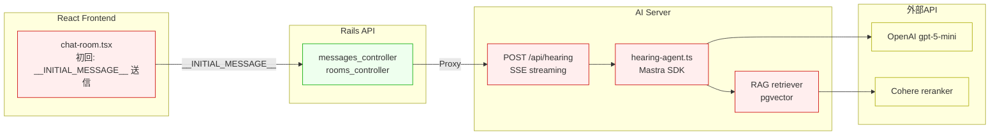
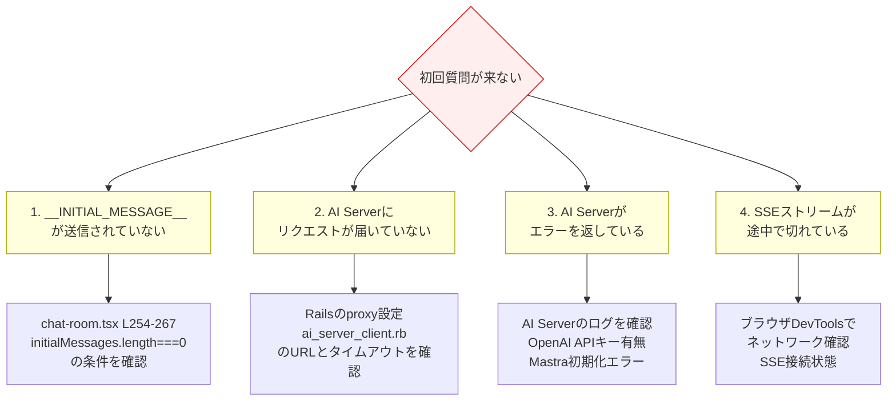
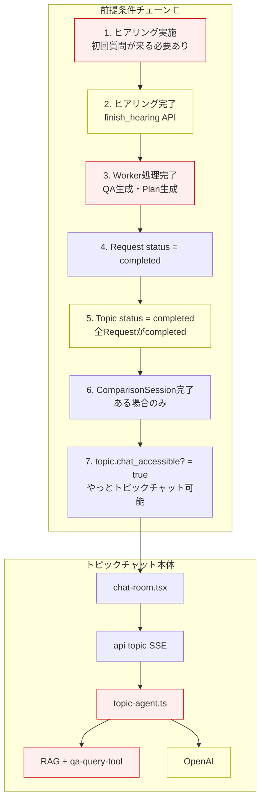
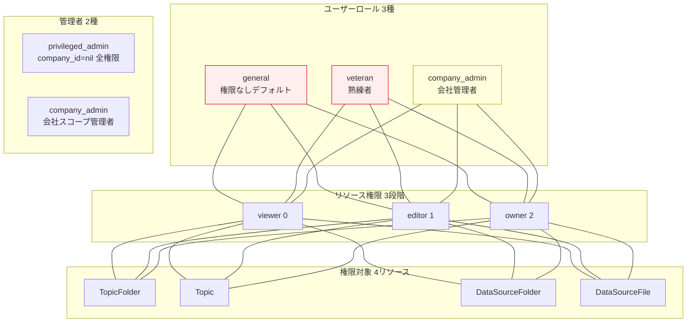
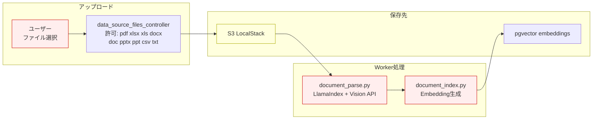
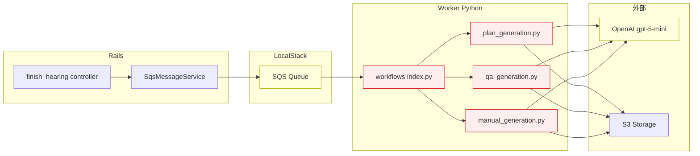
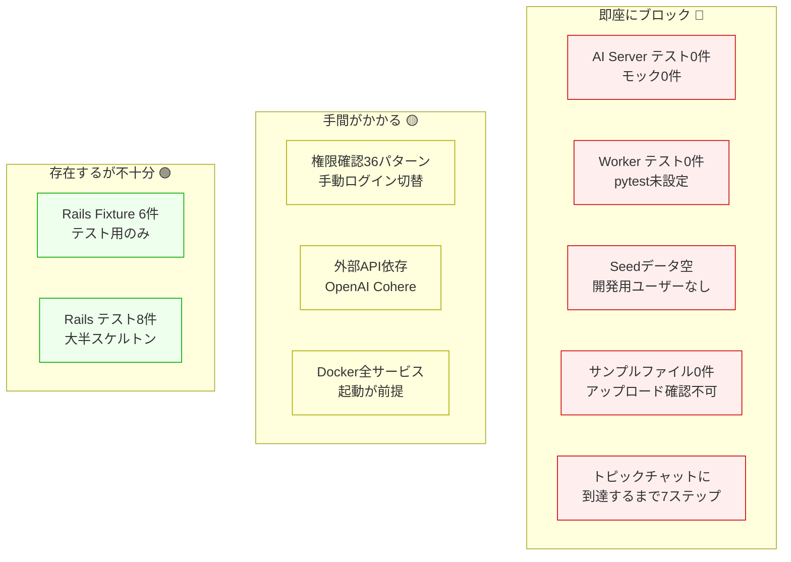

# 動作確認 障害マップ

## 概要

各フローごとに、動作確認を阻む要因を図示する。

凡例: `🔴` = ブロッカー、`🟡` = 手間がかかる、`🟢` = 確認可能

---

## フロー1: ヒアリングチャット（初回質問が来ない問題含む）

### 初回質問が飛んでこない問題の原因候補

フロントエンドが `__INITIAL_MESSAGE__` を送信 → AI Serverが受け取り → hearing-agentが初回応答を生成、という流れ。
以下のどこかで止まっている可能性がある。

### 障害ポイント

| # | 箇所 | 問題 | 影響 |
|---|------|------|------|
| 1 | AI Server全体 | **テストファイル 0件** | Agent・RAG・SSEが一切テストされていない |
| 2 | hearing-agent.ts | **OpenAI APIモック不在** | 実APIキーがないと動作確認不可 |
| 3 | RAG pgvector | **テストデータ/Seed不在** | ベクトルDBが空だとRAG検索が空振り |
| 4 | SSE streaming | **E2Eテスト不在** | フロント→Rails→AI Serverの結合が未検証 |
| 5 | React components | **Systemテスト空** | chat-app/chat-roomのUIテストなし |

---

## フロー2: トピックチャット（ヒアリング完了が前提条件）

### 障害ポイント

| # | 箇所 | 問題 |
|---|------|------|
| 6 | 前提条件チェーン | **ヒアリング→完了→Worker処理→ステータス更新を全て通過しないとトピックチャットに到達不可** |
| 7 | chat_accessible? | Topic.completed? かつ 全ComparisonSession.completed? が必要 |
| 8 | qa-query-tool | QAデータがDBに入っていないとツール呼び出しが空振り |
| 9 | ショートカット不在 | **ステータスを直接completedにするSeedやRakeタスクがない** |

---

## フロー3: 権限別の動作確認

### 障害ポイント

| # | 箇所 | 問題 |
|---|------|------|
| 10 | Seedデータ | **db/seeds.rbが空** → 各ロールのユーザーを毎回手動作成 |
| 11 | ロール切替 | **ロール切替機能なし** → 確認のたびにログアウト→別ユーザーでログイン |
| 12 | 権限組合せ | 3ロール x 3権限段階 x 4リソース = **36パターン** を手動確認 |
| 13 | Fixture存在するが | テスト用のみ（users.yml）、**開発環境のSeedには含まれていない** |

---

## フロー4: ファイルアップロード & AI読み込み

### 障害ポイント

| # | 箇所 | 問題 |
|---|------|------|
| 14 | サンプルファイル | **テスト用アップロードファイルが一切ない**（test/fixtures/files/ は空） |
| 15 | 確認手順 | 毎回「適当なPDFやDocxを探す→アップロード→Worker処理待ち→確認」が必要 |
| 16 | Worker処理 | SQS + S3 + OpenAI Embeddings全てが動いている必要あり |
| 17 | 処理結果確認 | パース・インデックス結果を確認するUIが限定的 |

---

## フロー5: AI生成（Worker）

### 障害ポイント

| # | 箇所 | 問題 |
|---|------|------|
| 18 | Worker全体 | **テストファイル 0件、pytest未設定** |
| 19 | generation系 | **LLMモック不在** → 毎回実API呼び出し必須 |
| 20 | SQS/S3 | LocalStack依存 → Docker起動必須 |

---

## 全体サマリ: 何がどれだけブロックしているか

---

## 優先度付き改善案

| 優先度 | 対象 | 施策 | 効果 |
|--------|------|------|------|
| **P0** | Seed | 開発用Seedデータ作成（各ロールユーザー + Topic + Request + Room + Message） | ログイン後すぐに各画面を確認可能に |
| **P0** | サンプルファイル | test/fixtures/files/ にPDF・DOCX・CSVサンプルを配置 | ファイルアップロード確認を即座に実施可能に |
| **P0** | トピックチャット | Rakeタスク `rake dev:setup_completed_topic` で完了済みTopicを作成 | ヒアリング全工程をスキップしてトピックチャットを確認可能に |
| **P1** | 権限確認 | Rakeタスク `rake dev:switch_role[user_id,role]` またはAdmin UIにロール切替ボタン | ログアウト不要で権限別確認が可能に |
| **P1** | AI Server | OpenAI/Cohereモック作成 + Agent単体テスト | APIキーなしでチャット確認可能に |
| **P1** | ヒアリング初回 | AI Serverの `__INITIAL_MESSAGE__` 処理のデバッグ・修正 | ヒアリングチャットが開始可能に |
| **P2** | Worker | pytest導入 + LLMモック | AI生成の単体確認 |
| **P2** | E2E | Playwright導入 | フロント結合の自動検証 |
| **P3** | CI | AI Server/Workerテストをパイプライン追加 | リグレッション防止 |
